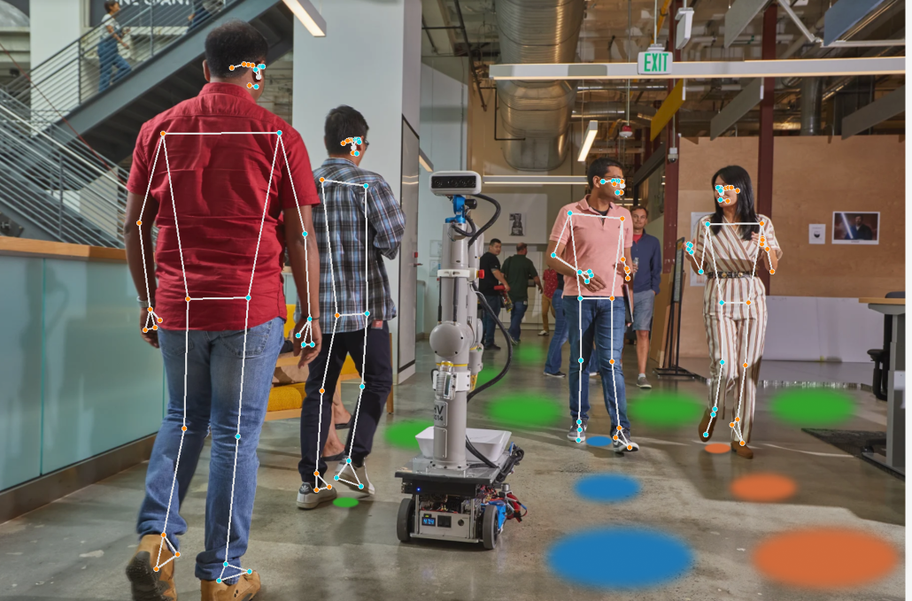

# Human Scene Transformer



Anticipating the motion of all humans in dynamic environments such as homes and offices is critical to enable safe and effective robot navigation. Such spaces remain challenging as humans do not follow strict rules of motion and there are often multiple occluded entry points such as corners and doors that create opportunities for sudden encounters. In this work, we present a Transformer based architecture to predict human future trajectories in human-centric environments from input features including human positions, head orientations, and 3D skeletal keypoints from onboard in-the-wild sensory information. The resulting model captures the inherent uncertainty for future human trajectory prediction and achieves state-of-the-art performance on common prediction benchmarks and a human tracking dataset captured from a mobile robot adapted for the prediction task. Furthermore, we identify new agents with limited historical data as a major contributor to error and demonstrate the complementary nature of 3D skeletal poses in reducing prediction error in such challenging scenarios.

If you use this work please cite our paper

```
@article{salzmann2023hst,
  title={Robots That Can See: Leveraging Human Pose for Trajectory Prediction},
  author={Salzmann, Tim and Chiang, Lewis and Ryll, Markus and Sadigh, Dorsa and Parada, Carolina and Bewley, Alex}
  journal={IEEE Robotics and Automation Letters},
  title={Robots That Can See: Leveraging Human Pose for Trajectory Prediction},
  year={2023}, volume={8}, number={11}, pages={7090-7097},
  doi={10.1109/LRA.2023.3312035}
}
```

*This is not an officially supported Google product.*

---

## Data

### JRDB

We provide a extensive prep-processing pipeline to convert the JRDB dataset,
JRDB was created as a detection and tracking dataset rather than a prediction
dataset. To make the data suitable for a prediction task, we first extract the
robot motion from the raw sensor data to account for the robot's motion.
Further, on the JRDB training split we combine algorithmic detection with the
ground truth labels from the tracking dataset to create authentic tracks as
input and labels for HST.
Note that we do not purely use the ground truth hand labeled tracks in the JRDB
train dataset as we find them to be overly smoothed giving away the future human
movement.
To adapt the JRDB dataset for prediction please follow [this](/data) README.

Make sure to adapt `<data_path>` in `config/<jrdb/pedestrians>/dataset_params.gin` accordingly.

If you want to use the JRDB dataset for trajectory prediction in PyTorch we
provide a [PyTorch Dataset wrapper](/jrdb/torch_dataset.py) for the processed dataset.

### Pedestrians ETH/UCY
Please download the raw data [here](https://github.com/StanfordASL/Trajectron-plus-plus/tree/master/experiments/pedestrians/raw).

## Training

### JRDB
```
python train.py --model_base_dir=./model/jrdb  --gin_files=./config/jrdb/training_params.gin --gin_files=./config/jrdb/model_params.gin --gin_files=./config/jrdb/dataset_params.gin --gin_files=./config/jrdb/metrics.gin --dataset=JRDB
```

### Pedestrians ETH/UCY
```
python train.py --model_base_dir=./models/pedestrians_eth  --gin_files=..config/pedestrians/training_params.gin --gin_files=..config/pedestrians/model_params.gin --gin_files=./config/pedestrians/dataset_params.gin --gin_files=./config/pedestrians/metrics.gin --dataset=PEDESTRIANS
```

---

## Evaluation

### JRDB
```
python jrdb/eval.py --model_path=./models/jrdb/ --checkpoint_path=./models/jrdb/ckpts/ckpt-30
```

#### Keypoints Impact Evaluation
```
python jrdb/eval_keypoints.py --model_path=./models/jrdb/ --checkpoint_path=./models/jrdb/ckpts/ckpt-30
```

vs

```
python jrdb/eval_keypoints.py --model_path=./models/jrdb_no_keypoints/ --checkpoint_path=./models/jrdb_no_keypoints/ckpts/ckpt-30
```

### Pedestrians ETH/UCY
```
python pedestrians/eval.py --model_path=./models/pedestrians_eth/ --checkpoint_path=./models/pedestrians_eth/ckpts/ckpt-20
```

---

## Results

Compared to the published paper we improved our data processing and fixed small
bugs in this code release. If you compare against our method please use the
following updated results.

On the JRDB dataset with dataset options as set [here](/config/jrdb/dataset_params.py):

|        | AVG  |  @ 1s | @ 2s |  @ 3s | @ 4s  |
|--------|------|-------|------|-------|-------|
| MinADE | 0.26 | 0.12  | 0.20 | 0.28  | 0.37  |
| MinFDE | 0.45 | 0.21  | 0.39 | 0.56  | 0.71  |
|  NLL   |-0.59 | -0.90 | -0.65| -0.08 | 0.32  |

On the ETH/UCY Pedestrians Dataset:

|        | ETH  | Hotel | Univ | Zara1 | Zara2 |  Avg  |
|--------|------|-------|------|-------|-------|-------|
| MinADE | 0.41 | 0.10  | 0.24 | 0.17  | 0.14  | 0.21  |
| MinFDE | 0.73 | 0.14  | 0.44 | 0.30  | 0.24  | 0.37  |


### Checkpoints
You can download trained model checkpoints for both `JRDB` and `Pedestrians (ETH/UCY)` datasets [here]()(Coming Soon).

To evaluate the pre-trained checkpoints you will have to adjust the path to the dataset in the respective `params/operative_config.gin` file.