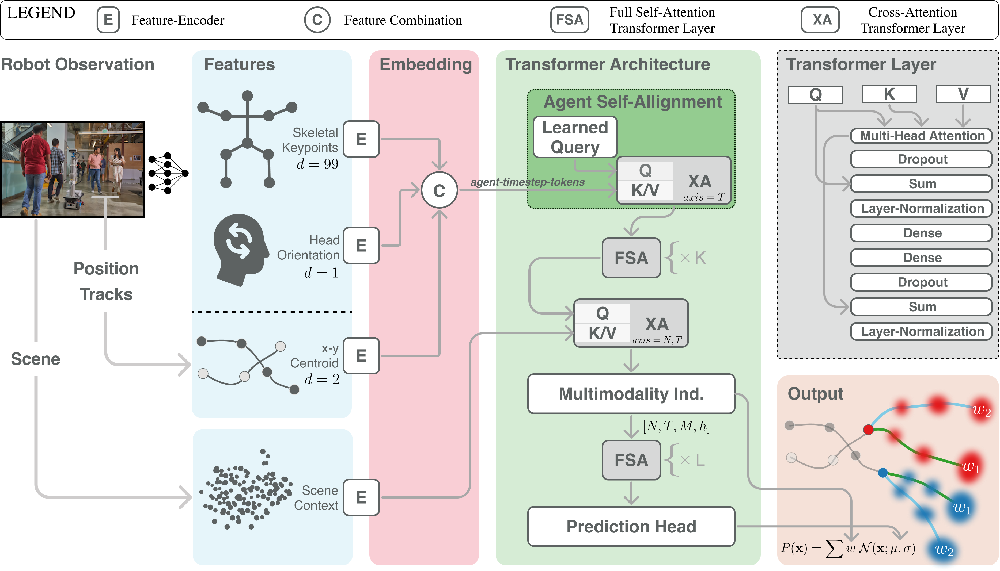

# Human Scene Transformer Architecture

Overview of the HST architecture: From the robot’s sensors we extract the scene context, the historic position tracks of each agent, and vision based skeletal keypoints/head orientation when feasible. All features are encoded individually before the agent features are combined via cross-attention (XA) using a learned query tensor. The resulting agent-timestep-tokens is passed to our Agent Self-Alignment layer which enables the use of subsequent full self-attention (FSA) layers. Embedded scene context is attended to via cross-attention (XA). After multimodality is induced and further FSA layers the model outputs the parameters of a Normal distribution for each agent at each prediction timestep. We can represent the full output structure as a Gaussian Mixture Model (formula in bottom right) over all possible futures where the mixture coefficients w come from the Multimodality Induction. Both cross-attention (XA) and full self-attention layers use the Transformer layer (top right) with different input configurations for Query (Q), Key (K), and Value (V).